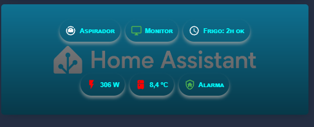

# 💊 Dashboard: Chips Avanzados con Estilo CSS (Glassmorphism)

Esta tarjeta presenta un diseño de "Chips" (píldoras de información) con efectos visuales avanzados, utilizando transparencias y desenfoques sobre una imagen de fondo. Está diseñada para ofrecer acceso rápido a dispositivos críticos (Aspirador, Monitores, Alarma) con un acabado estético de alta gama.



## 🚀 Características Visuales

* **Fondo Dinámico:** Capa de imagen personalizada (`logo-cover.png`) con un degradado superior para mejorar el contraste de los textos.
* **Efecto Glassmorphism:** Uso de `backdrop-filter: blur(5px)` para crear un efecto de cristal esmerilado en cada chip.
* **Tipografía Estilizada:** Implementación de `font-variant: small-caps` para un aspecto más profesional y técnico.
* **Sombreado "Glow":** Sombras suaves (`box-shadow`) con tonos claros para dar profundidad sobre el fondo oscuro.
* **Estados Dinámicos:** Colores de iconos y textos que cambian en tiempo real según el estado de la entidad (ej: el chip del frigorífico cambia de color si el interruptor está apagado).

---

## 🛠️ Requisitos de Instalación

Para que esta tarjeta funcione, debes tener instalados a través de **HACS**:

1.  **Mushroom Cards:** Proporciona la base de los `chips-card`.
2.  **Stack-in-card:** Permite agrupar los bloques de chips sobre la misma imagen de fondo.
3.  **Card-mod:** Vital para inyectar el código CSS personalizado (transparencias, filtros de desenfoque y tipografía).

### 📁 Configuración de Archivos
Ubica tu imagen de fondo en:
`/config/www/images/logo-cover.png` (accesible en el código como `/local/images/logo-cover.png`).

---

## ⚙️ Estructura del Código YAML

La tarjeta se organiza en tres filas principales:
1.  **Fila Superior:** Controles de dispositivos (Aspirador Dreame, Monitores de trabajo, Recordatorios).
2.  **Espaciador:** Un chip invisible (`alignment: left`) usado para ajustar la composición visual.
3.  **Fila Inferior:** Sensores críticos (Consumo eléctrico, Temperatura del frigorífico y estado de la Alarma).

### Ejemplo de lógica CSS aplicada en cada Chip:
```css
ha-card {
  background: rgba(0, 0, 0, 0.0) !important; /* Total transparencia de fondo */
  backdrop-filter: blur(5px);               /* Desenfoque de fondo */
  border: none !important;                  /* Elimina bordes predefinidos */
  --text-color: cyan;                       /* Color de texto personalizado */
  font-variant: small-caps;                 /* Texto en versalitas */
}
