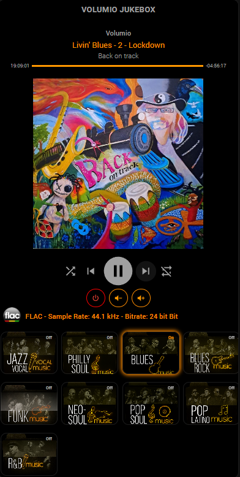

# 📻 Dashboard Jukebox: Control de Audio Avanzado

Esta tarjeta ofrece una interfaz completa y estética para el control de reproductores de música en Home Assistant (optimizado para Volumio). Está diseñada para usuarios que buscan no solo controlar la reproducción, sino también visualizar la calidad técnica del audio y gestionar listas de reproducción mediante una botonera visual.

## 🖼️ Vista Previa

## 🌟 Características Principales
* **Visualización de Metadatos**: Identificación automática de formato (FLAC, MP3, DSD), Sample Rate y Bitrate en tiempo real.
* **Botonera de Géneros**: Grid interactivo de 4 columnas con portadas personalizadas para lanzar listas de reproducción o escenas.
* **Control de Volumen Especializado**: Botones dedicados para gestión de volumen externo (amplificadores) mediante escenas.
* **Diseño Minimalista**: Estética "Dark Mode" con acentos en naranja (#FF8C00) y bordes redondeados.
* **Modo de reproducción**: Reproduccion en modo aleatorio.
* **Tipo de reproducción**: Por género musical.
* **Acción de pulsación**: On/Off. Para detener la reproduccion solo hay que volver a pulsar sobre el género activo.

## 🛠️ Requisitos (HACS)
Para una correcta visualización, es necesario instalar los siguientes complementos desde HACS:

1.  **[Vertical Stack In Card](https://github.com/ofekashery/vertical-stack-in-card)**: Para agrupar los módulos sin divisiones.
2.  **[Maxi Media Player](https://github.com/vdsandeg/maxi-media-player)**: El núcleo del reproductor.
3.  **[Mushroom Cards](https://github.com/piitaya/lovelace-mushroom)**: Para la información de pistas y chips de control.
4.  **[Button Card](https://github.com/custom-cards/button-card)**: Para la lógica avanzada y el estilo de la cuadrícula de géneros.
5.  **[Card Mod](https://github.com/thomasloven/lovelace-card-mod)**: Para inyectar CSS personalizado y ajustes de transparencia.

## 📁 Estructura de Archivos
La tarjeta utiliza recursos locales que deben estar en tu carpeta `/config/www/`:
* **Iconos de Formato**: `/local/ico/` (flac3.png, mp3.png, dsd.png, cd1.png).
* **Portadas de Géneros**: `/local/jukebox/` (Jazz_vocal.jpg, Philly.png, etc.).

## ⚙️ Configuración de Entidades
Antes de copiar el código, asegúrate de renombrar o tener configuradas las siguientes entidades:
* `media_player.nombre_de_tu_player`: Tu reproductor principal.
* `sensor.volumio_file_type / samplerate / bitrate`: Sensores de metadatos.
* `input_boolean.tu_genero`: Para cada botón de la cuadrícula musical.
* `scene.volumen_mas / menos`: Para el control remoto de audio.
