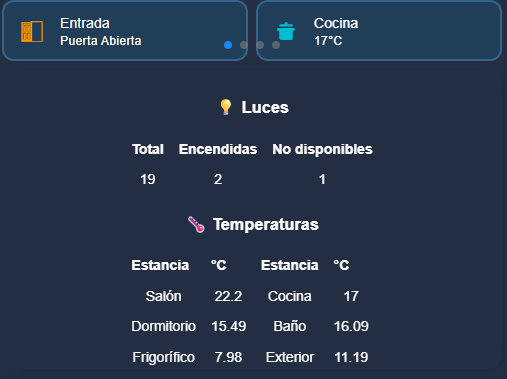
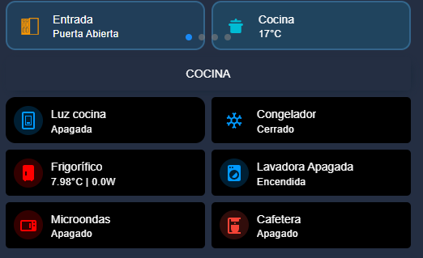

# 🏠 Control Dinámico de Estancias (Multi-Room Dashboard)

Este módulo de interfaz permite gestionar de forma inteligente las diferentes estancias de la casa (Entrada, Cocina, Salón) mediante un sistema de condiciones. La tarjeta adapta su contenido y visibilidad basándose en la selección del usuario y el estado de actividad.

## 🖼️ Capturas de Pantalla
| Estado: Modo Espera | Estado: Controles Activos | 
| :---: | :---: |
|  |  |

## 🌟 Funcionalidades Clave
* **Navegación Condicional**: Utiliza `input_select.estancia_seleccionada` para alternar entre los paneles de Entrada, Cocina y Salón sin recargar la página.
* **Modo de Ahorro Visual (Inactividad)**: Implementa un `input_boolean.mostrar_controles_estancia` que, al estar en `off`, oculta los controles críticos y muestra un resumen (Markdown) de temperaturas y estados generales.
* **Feedback Visual Avanzado**:
    * **Efecto Ping**: Las luces encendidas muestran una animación de pulsación radial.
    * **Colores Dinámicos**: Los iconos y textos secundarios cambian de color (Oro/Rojo/Azul) según el estado de la entidad.
    * **Estética Coherente**: Diseño basado en fondo negro puro (`#000000`) con bordes en azul neón (`#0099ff`) para dispositivos de alta carga tecnológica.

 ## ⏱️ Automatización: Ocultación por Inactividad

Para que el panel de control pase al "Modo Espera" automáticamente, se utiliza un temporizador (`timer`) y una automatización que detecta cuando dejas de interactuar con la pantalla.

### 1. Crear el Temporizador (Helper)
Añade un temporizador en Home Assistant:
* **Nombre:** Temporizador Pantalla
* **Entidad:** `timer.temporizador_pantalla`
* **Duración:** `00:05:00` (5 minutos recomendado)

### 2. La Automatización (YAML)
Copia esta automatización para gestionar el cambio de estado:

```yaml
alias: "Dashboard: Ocultar controles por inactividad"
description: "Apaga los controles si no hay movimiento o interacción"
trigger:
  - platform: event
    event_type: timer.finished
    event_data:
      entity_id: timer.temporizador_pantalla
action:
  - service: input_boolean.turn_off
    target:
      entity_id: input_boolean.mostrar_controles_estancia
mode: restart

## 🛠️ Requisitos de HACS
Es imprescindible tener instalados los siguientes complementos para el correcto funcionamiento del YAML:

1.  **[Mushroom Cards](https://github.com/piitaya/lovelace-mushroom)**: Base de todos los controles de luces, alarmas y plantillas.
2.  **[Stack In Card](https://github.com/custom-cards/stack-in-card)**: Para agrupar tarjetas sin divisiones visibles.
3.  **[Card Mod](https://github.com/thomasloven/lovelace-card-mod)**: Fundamental para las animaciones CSS (ping) y el estilo de los bordes.

## 🔧 Configuración del Sistema
Para que esta tarjeta funcione, debes tener configurados los siguientes elementos en tu `configuration.yaml` o mediante la interfaz:

* **Helper (Selector)**: `input_select.estancia_seleccionada` (Opciones: `entrada`, `cocina`, `salon`).
* **Helper (Interruptor)**: `input_boolean.mostrar_controles_estancia` (Controla el modo espera).
* **Grupo de Luces**: `group.luces` (Para el conteo automático en el panel de Entrada).

## 🚀 Uso e Instalación
1.  Copia el código YAML proporcionado.
2.  Crea una tarjeta de tipo **Manual** en tu Dashboard.
3.  Pega el contenido.
4.  **Personalización**: Los sensores de temperatura (ej. `sensor.salon_temperature`) y switches de Proxmox/Domótica deben ajustarse a tus nombres reales de entidad.
