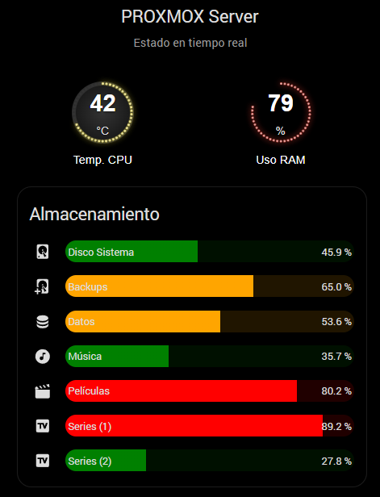

# 🖥️ Monitorización de Servidor (Proxmox/Hardware)

Esta tarjeta proporciona una visión técnica y detallada del estado de salud de un servidor doméstico o nodo de virtualización. Combina indicadores analógicos para recursos volátiles (CPU/RAM) y barras de progreso para el control de almacenamiento masivo.

## 🖼️ Vista Previa

## 🌟 Características Principales
* **Gauges LED Personalizados**: Indicadores circulares con gradientes radiales y efecto de LEDs para la temperatura de la CPU y el uso de memoria RAM.
* **Gestión de Almacenamiento Multinivel**: Monitorización de múltiples puntos de montaje (Sistema, Backups, Media, etc.) en una sola vista compacta.
* **Sistema de Alertas Visuales**: 
    * **Verde (0-50%)**: Estado óptimo.
    * **Naranja (50-80%)**: Precaución, capacidad media.
    * **Rojo (80-100%)**: Alerta de almacenamiento crítico.
* **Estética Dark**: Fondo negro puro (`#000000`) diseñado para integrarse en Dashboards de alta fidelidad.

## 🛠️ Requisitos de HACS
Para que la tarjeta se renderice correctamente, es necesario instalar:

1. **[Custom Gauge Card](https://github.com/custom-cards/custom-gauge-card)**: Para los relojes de CPU y RAM.
2. **[Bar Card](https://github.com/custom-cards/bar-card)**: Para las gráficas de barras de los discos.
3. **[Card Mod](https://github.com/thomasloven/lovelace-card-mod)**: Para aplicar los estilos de fondo y transparencia.

## ⚙️ Configuración de Entidades
Asegúrate de reemplazar las siguientes entidades con las de tu propio sistema:

| Sección | Entidad de ejemplo | Descripción |
| :--- | :--- | :--- |
| **CPU** | `sensor.proxmox_temperatura_de_composite` | Temperatura del procesador. |
| **RAM** | `sensor.proxmox_uso_de_memoria` | Porcentaje de memoria utilizada. |
| **Discos** | `sensor.proxmox_uso_de_disco_de_...` | Sensores de uso de disco (%). |

## 🚀 Instalación
1. Copia el código YAML del archivo correspondiente en esta carpeta.
2. En tu Dashboard de Home Assistant, añade una tarjeta de tipo **Manual**.
3. Pega el código y ajusta los nombres de tus sensores de Proxmox o del sistema que utilices.
