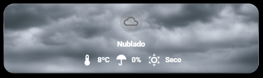

# 🌤️ Tarjeta de Climatología Dinámica y Animada

Esta tarjeta para Home Assistant ofrece una experiencia visual inmersiva. No solo muestra datos meteorológicos, sino que transforma completamente su aspecto (fondo, iconos y animaciones) basándose en el estado del sol y las condiciones climáticas actuales.

## 🖼️ Vista Previa

## 🌟 Características Principales
* **Fondos Dinámicos**: Utiliza `card-mod` para cambiar la imagen de fondo en tiempo real. Soporta estados de: noche, amanecer, soleado, lluvia, nieve y nublado.
* **Ciclo Solar**: Detecta si el sol está por encima o por debajo del horizonte para ajustar los gradientes y la iluminación de la tarjeta.
* **Animaciones CSS Avanzadas**:
  * **Modo Día**: El icono del sol rota continuamente de forma suave.
  * **Modo Noche**: El icono de la luna tiene un efecto de "latido" (pulsación) animado mediante keyframes.
* **Sensores Críticos**: Visualización rápida de temperatura, probabilidad de lluvia y estado de humedad/lluvia en tiempo real.

## 🛠️ Requisitos de HACS
Para que esta tarjeta funcione correctamente, debes tener instalados los siguientes repositorios:

1. **[Stack In Card](https://github.com/custom-cards/stack-in-card)**: Permite agrupar múltiples tarjetas en una sola sin bordes visibles.
2. **[Mushroom Cards](https://github.com/piitaya/lovelace-mushroom)**: Proporciona la base para los chips y las plantillas de iconos.
3. **[Card Mod](https://github.com/thomasloven/lovelace-card-mod)**: Fundamental para aplicar los estilos CSS, las animaciones y los fondos dinámicos.

## 📁 Estructura de Archivos Locales
La tarjeta busca las imágenes en `/local/clima/`. Debes crear dicha carpeta en tu directorio `www` y añadir los siguientes archivos:
* `noche3.png`
* `amanecer.png`
* `soleado3.png`
* `lloviendo2.png`
* `nublado.png`

## ⚙️ Configuración y Personalización
Para adaptar el código a tu instancia, busca y reemplaza las siguientes entidades en el YAML:
* `sensor.aemet_condition`: Sensor de estado meteorológico (compatible con cualquier integración de clima que use estados estándar).
* `sensor.tu_sensor_temperatura`: Tu termómetro exterior.
* `sensor.tu_probabilidad_lluvia`: Sensor de porcentaje de lluvia.
* `binary_sensor.sensor_de_lluvia`: (Opcional) Sensor físico para detectar lluvia inmediata.

> **Nota sobre Iconos**: Esta tarjeta utiliza `phu:` (Hue Icons) para el icono de noche animado. Si no usas Hue Icons, puedes cambiarlo por cualquier icono de `mdi:`.
