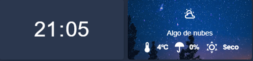

# 🏠 Home Assistant Dashboard - Clima & Alertas Dinámicas

Este repositorio contiene la configuración avanzada para el panel de control meteorológico y el sistema de avisos de seguridad. El diseño está optimizado para su visualización desde el puesto de trabajo (**Lenovo Ideacentre**) mientras el servidor corre en **Proxmox**.

## 📸 Vistas Previas
| Estado de Alerta Activa (Fijo) | Estado de Clima Normal |
| :---: | :---: |
|  |  |

---

## 🛠️ Requerimientos Técnicos

### Dependencias HACS (Obligatorias)
Para que la interfaz funcione correctamente, debes instalar:
* [Mushroom Cards](https://github.com/piitaya/lovelace-mushroom) - Para los chips y elementos de plantilla.
* [Stack-in-card](https://github.com/custom-cards/stack-in-card) - Para agrupar los elementos en un solo bloque visual.
* [Card-mod](https://github.com/thomasloven/lovelace-card-mod) - Para los fondos dinámicos y animaciones CSS.
* [Meteoalarm Card](https://github.com/MrInternal/meteoalarm-card) - Para la integración de avisos oficiales.

### Recursos Multimedia
Las imágenes deben estar alojadas en la carpeta `/config/www/clima/` (accesibles vía `/local/clima/`):
* `noche3.png`, `amanecer.png`, `soleado3.png`, `lloviendo.png`, `nublado.png`.

---

## ⛈️ Comportamiento de la Tarjeta

La tarjeta utiliza lógica condicional de Home Assistant para alternar entre dos estados visuales:

### 1. Modo Alerta (Prioritario)
Cuando el sensor meteorológico de Valencia (`binary_sensor.valencia`) pasa a estado **ON**, la tarjeta de clima convencional se oculta y se muestra de forma **fija** la tarjeta de **Meteoalarm**. 
* Este estado persiste ininterrumpidamente mientras la alerta esté vigente, asegurando que el aviso de seguridad sea lo primero que veas al consultar el dashboard desde tu PC de trabajo.

### 2. Modo Clima Dinámico
Cuando no hay alertas activas, la tarjeta presenta un diseño visual enriquecido:
* **Fondos según condición:** Cambia la imagen de fondo automáticamente mediante CSS `linear-gradient` basándose en la entidad `sensor.aemet_condition`.
* **Ciclo Solar:** * **Día:** Fondo iluminado y animación de rotación continua (`spin`) en el icono del sol.
    * **Noche:** Fondo oscuro y animación de pulsación (`beat`) en el icono de la luna.
* **Datos Integrados:** Muestra temperatura (OpenWeatherMap), probabilidad de precipitación (AEMET) y el estado real del sensor de inundación físico de la vivienda.

