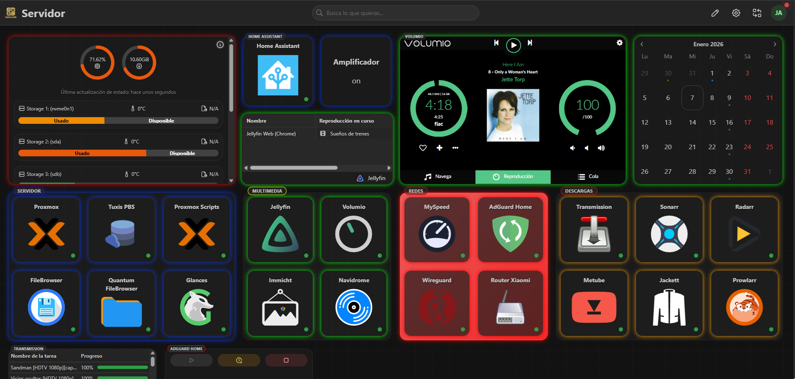

# 🖼️ Homarr: Dashboard Unificado

Este directorio contiene la configuración visual y técnica del dashboard principal. Homarr actúa como la interfaz centralizada para gestionar todos los servicios alojados en el nodo Proxmox (HP EliteDesk) y el servidor de audio (Dell Optiplex).

## 📸 Vista General

  

*Estado final del panel con el tema "Dark Tech" y los widgets organizados por categorías.*

*Estado final del panel con el tema "Dark Tech" y los widgets adaptados para movil.*

## 🎨 Personalización CSS (Look & Feel)
El panel utiliza una hoja de estilos personalizada para lograr una estética profesional, técnica y funcional. Los estilos están diseñados para reducir la fatiga visual mientras mantienen una jerarquía clara.

### Características del Diseño:
* **Fondo Técnico:** Una cuadrícula tipo "blueprint" con opacidad reducida sobre un fondo gris carbono.
* **Efecto Cristal (Glassmorphism):** Widgets con transparencia y desenfoque de fondo (`backdrop-filter`).
* **Codificación por Colores:** Uso selectivo de bordes neón y fondos degradados para identificar servicios de Red, Multimedia, Descargas e Infraestructura.

## 📄 Archivos de Configuración
* **`custom_css.yaml`**: Contiene todas las clases CSS aplicadas al panel.

### 💡 Cómo aplicar los estilos:
1. Accede a **Ajustes > Apariencia** en tu instancia de Homarr.
2. Copia el contenido de `custom_css.yaml` en el cuadro de **Custom CSS**.
3. Para los bordes neón individuales, añade la clase correspondiente (ej: `borde-neon-verde`) en los metadatos de cada widget.

---

## 🛠️ Integración Especial: Volumio
Uno de los puntos clave de este dashboard es el widget de **Volumio**. 
* **Escalado:** Se utiliza un wrapper HTML externo para incrustar la interfaz al **65%**, permitiendo el control total del reproductor sin ocupar todo el espacio del panel.
* **Seguridad:** Configuración de `use_x_frame_options: false` en Home Assistant para permitir la carga del recurso.
